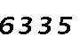

# HustLogin
A python-lib for authenticating HustPass@2023


> Faster, Easier, Lighter

Attention: HustPass login protocol underwent a major update on 2023/05/23, moving from DES to RSA, previous login libraries are now deprecated.

Tutorials on [Bilibili](https://www.bilibili.com/video/BV1bX4y1j7vR/)

Plug-in for python-requests [HustAuth](https://github.com/MarvinTerry/HustAuth)

## Installing

The library has been made publicly available on PyPI **[hust_login](https://pypi.org/project/hust-login/)**

Installing by a single line of command, and requirements will be automatically handled.

```
pip install hust_login
```

Additionally, you need to install ```tesseract-ocr``` back end:

- Win: [download binary here](https://tesseract-ocr.github.io/tessdoc/Downloads.html), "3rd party Windows exe’s/installer" recommanded.
- Linux: run ```sudo apt install tesseract-ocr```

## Documentation
### **```hust_login.HustLogin(username, password, headers=None)```**

  PARAMETERS:
  - username -- Username of pass.hust.edu.cn  e.g. U2022XXXXX
  - password -- Password of pass.hust.edu.cn
  - headers  -- Headers you want to use, optional (the default header works fine)

  RETURNS:
  - A **```requests.Session```** object that is already logged in
    - use it the same way you use requests, e.g.
      ```python
      s = hust_login.HustPass('U2022XXXXX','YOUR-PASSWORD')
      ret = s.get(your_url)
      print(ret.text)
      ```
### **```hust_login.HustLogin(username, password, headers=None)```**

  PARAMETERS: Same as HustLogin

  RETURNS:
  - A class that contains wrapped common functions like QueryElectricityBills, QueryCurriculum, QueryFreeRoom, etc.

> BE CREATIVE!!!

## Demo
Demonstrating how to query the exam result
- CODE:
  ```python
  from hust_login import HustPass
  from bs4 import BeautifulSoup
  
  with HustPass('U2022XXXXX','YOUR-PASSWORD') as s:
      ret = s.get('http://hub.m.hust.edu.cn/cj/cjsearch/findcjinfo.action?xn=2022&xq=0')
      soup = BeautifulSoup(ret.content, 'html.parser')
      for row in soup.find_all('tr'):
          for col in row.contents:
              print(col.text.strip(), end=" ")
          print("")
  ```
  It's **recommended** to call ```HustPass``` in the ```with``` statement, as shown.
- RESULT:
  ```
  setting up session...
  captcha detected, trying to decaptcha...
  decaptching...
  encrypting u/p...
  captcha_code:4608
  posting login-form...
  ---HustPass Succeed---
   课程名称  课程学分  课程成绩  备注  
   微积分（一）（上）  5.5  90
   综合英语（一）  3.5  94
   线性代数  2.5  92
   工程制图（一）  2.5  98
   综合英语（二）  3.5  93
   微积分（一）（下）  5.5  94
    ...
    ...
    ...
   加权排名成绩  91.71
   必修课总学分  50.50
   公选课总学分  2.00
   总学分  52.5
  ```

## Development

If the lib outdated, try to make a pull request to get this lib working again!

The js-scripts that enable encrypting and posting the login-form during regular login are publicly available [login_standar.js?v=20230523](https://pass.hust.edu.cn/cas/comm/js/login_standar.js?v=20230523). My job was to translate the js into python and deal with the captcha code.

Here are something worth mentioning if you are developing a newer version of the lib:

- Encrytion: 
  - PublicKey is encoded in base64, decode it first.
  - The usr/pass you encrypted should be encoded in base64, and converted into the text instead of bytes. Look deeper into my code to see how it works.
- Decaptcha
  - The ```BytesIO``` method is used to convert byte-stream containing the gif into the file.
  - Genius approach applied to combine and de-noise the 4-frame gif: As observed, the **number** pixels would appear in 3 frames at least, while **noise** pixels are less than 2. This provides a super accurate way to de-noise the picture. Here's the code clip, try to understand:
    ```python
    img_merge = Image.new(mode='L',size=(width,height),color=255)
    for pos in [(x,y) for x in range(width) for y in range(height)]:
        if sum([img.getpixel(pos) < 254 for img in img_list]) >= 3:
            img_merge.putpixel(pos,0)
    ``` 
     
  
- Network
  - A common fake User-Agent is essential! HustPass has blocked python-requests's default User-Agent.


